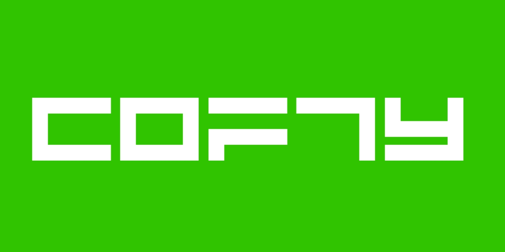

# The Cofty Programming Language
This is the main source code repository for Cofty. It contains the compiler, standard library, and documentation

### The main directions in which we are working in the process of developing this programming language
- More abstractions and syntax sugar (advanced parser)
- Performance and flexibility

### Installing
At first, you need
- `gcc`
- [`Python >= 3.10`](https://www.python.org/downloads/)
- 
> __*The compilation of the code is not ready yet, and the language itself is not finished yet and does not have support for the minimum allowable syntax. Using the project's capabilities at this stage is at your own risk!*__
